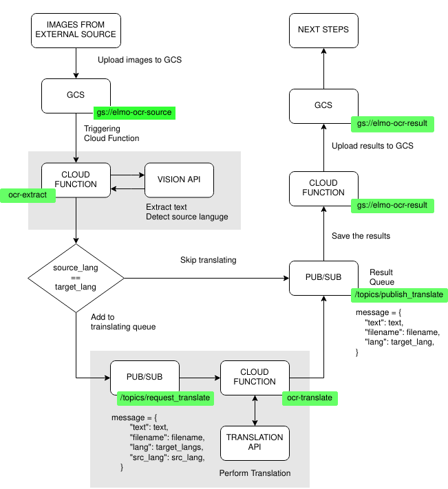

# Optical Character Recognition (OCR) 
Reference: https://cloud.google.com/functions/docs/tutorials/ocr




### Create virtualenv
```
virtualenv venv
source venv/bin/activate
```

### Installing packages
```
pip install -r requirements.txt
```

### Enable APIs
```
gcloud services enable cloudbuild.googleapis.com
gcloud services enable cloudfunctions.googleapis.com
gcloud services enable pubsub.googleapis.com
gcloud services enable vision.googleapis.com
gcloud services enable translate.googleapis.com
gcloud services enable storage-component.googleapis.com
```

### Export Variables
```
# Set your GCP project ID
export PROJECT_ID=""

# Set Bucket to upload images (globally unique name)
export SOURCE_BUCKET=""

# Set Bucket to save ocr result (globally unique name)
export RESULT_BUCKET=""

# Set topic to send translation request
export TRANSLATE_TOPIC=""

# Set topic to send ocr/translation results
export RESULT_TOPIC=""

# Set target translation language, separated with "," if more than one
# Language code must be in ISO 639-1 Code
export TARGET_LANG=""
```

### Creating Resources
```
# create bucket and topics
gsutil mb gs://$SOURCE_BUCKET
gsutil mb gs://$RESULT_BUCKET
gcloud pubsub topics create $TRANSLATE_TOPIC
gcloud pubsub topics create $RESULT_TOPIC
```
```
# create function to process images from bucket
gcloud functions deploy ocr-extract \
--runtime python37 \
--trigger-bucket $SOURCE_BUCKET \
--entry-point extract_text \
--set-env-vars "^:^PROJECT_ID=$PROJECT_ID:TRANSLATE_TOPIC=$TRANSLATE_TOPIC:RESULT_TOPIC=$RESULT_TOPIC:TARGET_LANG=$TARGET_LANG"
```
```
# create function to translate extracted texts
gcloud functions deploy ocr-translate \
--runtime python37 \
--trigger-topic $TRANSLATE_TOPIC \
--entry-point translate_text \
--set-env-vars "PROJECT_ID=$PROJECT_ID,RESULT_TOPIC=$RESULT_TOPIC"
```
```
# create function to send result to RESULT_BUCKET
gcloud functions deploy ocr-save \
--runtime python37 \
--trigger-topic $RESULT_TOPIC \
--entry-point save_result \
--set-env-vars "RESULT_BUCKET=$RESULT_BUCKET"
```

### Upload file to source bucket to trigger ocr-extract function

```
gsutil cp <FILE_NAME> gs://$SOURCE_BUCKET/<FILE_NAME>
```

### See the result

```
gsutil cat gs://$SOURCE_BUCKET/<FILE_NAME>
```